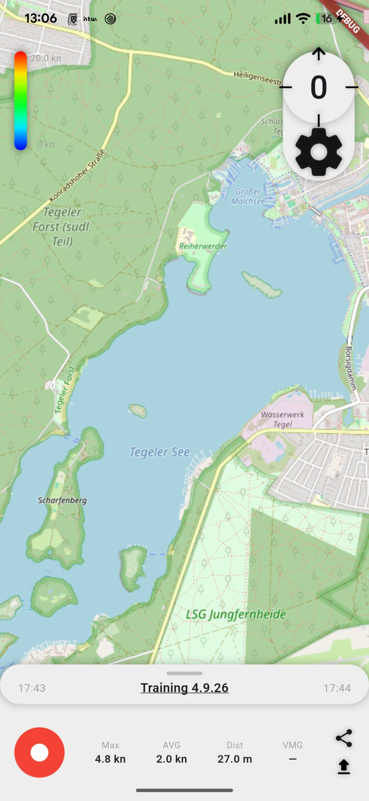

# TackTicks

**A Flutter app that records, processes and visualizes sailing regatta metrics — on the water, without a network.**



Sailors get plenty of numbers *after* a race and almost nothing useful *during* one. TackTicks
records a full session on the phone — position, speed, heading, heel — shows the essentials at a
glance while sailing, and turns the track into something you can actually read afterwards: where
you were fast, where you lost height, how a manoeuvre really went.

Everything works offline. Boats lose signal the moment they leave the harbour, so the app records
into a local database first and syncs later, when there is a connection again.

---

## Features

**Recording**
Streams GPS at up to 4 Hz (highest accuracy, no distance filter) together with the magnetometer
and accelerometer, and writes every fix to the local database as it comes in. Speed over ground,
course over ground, magnetic heading, heel and pitch are stored per point. The racing view locks
to landscape and holds a wakelock for the whole session.

**Operated by the volume buttons, not the touchscreen**
Wet hands and a mounted phone make a touchscreen least reliable exactly when it matters, so the
racing view runs entirely on hardware keys intercepted natively: volume down and up page through
speed, heading and racing, and **both at once ends the session**. Swipe gestures are disabled so
no stray touch can change the view. The same mounting assumption — landscape, volume keys up — is
what fixes the accelerometer axes behind heel and pitch.

**Wind is entered afterwards, not before**
True wind angle and VMG are never stored — they are derived from COG, SOG and the wind direction
on the fly. That means the wind direction can be corrected after the session and every derived
number recalculates. You are not stuck with the guess you made before the start.

**Boat-to-boat ranging over BLE**
Each phone advertises its own peer ID and scans for the others at the same time, logging signal
strength against the current GPS point — enough to reconstruct how far apart boats were over a
race, not just where each one sailed. Two things make that harder than it reads. Android silently
drops any advertisement whose bytes match the previous one from the same device, and a payload
that is only a sail number never changes, so a default scan yields exactly one packet per boat
and then nothing at all; the scan has to opt into continuous updates to see the rest. And RSSI
swings by roughly ±10 dBm packet to packet at a fixed distance — several boat lengths once
converted — so each GPS fix stores the median of every packet heard since the previous one.
Median rather than mean, because multipath over water produces occasional deep dropouts that
drag an average a long way. The measurement table is deliberately technology-agnostic
(`tech: 'ble' | 'uwb' | …`) so more precise ranging can be added without a migration.

**Shared trainings**
A session is uploaded into a training identified by a short code. Everyone sailing the same
session enters the same code, and all tracks land together — the basis for comparing boats
against each other rather than only against yourself.

**Export**
GPX 1.1 with a custom extension namespace, so the sailing-specific data (heel, ranging) survives
the export instead of being flattened away. Handed straight to the system share sheet.

---

## Tech stack

| | |
|---|---|
| **Flutter / Dart** | One codebase, and the sensor and BLE plugin ecosystem is good enough to avoid going native |
| **Riverpod** | State management — sensor streams, BLE state and recording state are independent and compose cleanly as providers |
| **Drift + SQLite** | Local, typed, offline-first storage. A session is thousands of GPS rows; this has to survive an app kill mid-race |
| **Supabase** | Postgres, anonymous auth and RPC for the training-code lookup. Sync is an upload of local truth, not a live dependency |
| **flutter_map** | Track rendering on OpenStreetMap tiles, coloured by speed |
| **flutter_blue_plus + flutter_ble_peripheral** | Scanning and advertising simultaneously — most BLE packages only do one side |

## Architecture

Layered, with the UI depending on providers rather than on services directly:

```
lib/
├── main.dart               # Supabase init, anonymous sign-in, app root
├── screens/
│   ├── home/               # Session list, map, compass panel for wind entry
│   └── racing/             # Live views: speed, heading, racing — volume-key driven
├── controllers/            # RecordingController — owns the session lifecycle,
│                           #   fans GPS + sensor + BLE streams into the database
├── providers/              # Riverpod wiring: sensors, BLE, sessions, repositories, UI
└── data/
    ├── entities/           # Plain domain models
    ├── database/           # Drift schema + generated code
    ├── repositories/       # Queries — the only thing that touches the database
    └── services/           # GPS, sensors, BLE, GPX export, upload, TWA/VMG maths
```

The rule that keeps this honest: **services never know about the database, repositories never
know about the UI.** `performance_calc.dart` is pure functions, which is why the wind can be
changed after the fact for free.

---

## Getting started

Requires the Flutter SDK with Dart `^3.11.5`.

```bash
flutter pub get
dart run build_runner build --delete-conflicting-outputs
flutter run
```

The `build_runner` step is not optional — Drift generates `app_database.g.dart`, and the project
will not compile without it. Re-run it whenever `lib/data/database/tables.dart` changes.

**Permissions.** The app needs precise location (while recording) and Bluetooth scan/advertise.
Both platforms prompt on first use; if precise location is denied the recording state carries that
through to the UI rather than silently logging garbage.

**Volume-key capture is Android-only for now.** The keys are intercepted in
`MainActivity.kt` and forwarded over the `…/volume_buttons` method channel; there is no iOS
counterpart yet, so the racing view has no hardware controls there.

**Backend.** Supabase URL and publishable key are set in `lib/main.dart`. The publishable key is
meant to ship inside the client — access is governed by row level security on the Postgres side,
and users are signed in anonymously so a session belongs to a stable identity without anyone
having to create an account.

---

## Status

Work in progress, developed solo alongside my B.Sc. in International Media & Computing at HTW
Berlin. It is the mobile continuation of an earlier Unity prototype.

Recording, local storage, GPX export, BLE ranging and Supabase upload work end to end. The
analysis side — replaying a session, comparing boats within a training, manoeuvre detection — is
where the work is going next.

**Lorenz Brach** · [Portfolio](https://loris1109.github.io) · [GitHub](https://github.com/Loris1109)
